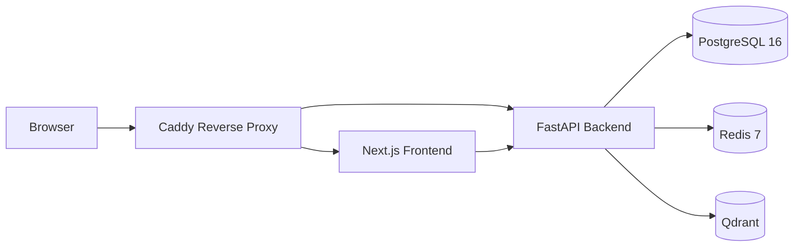
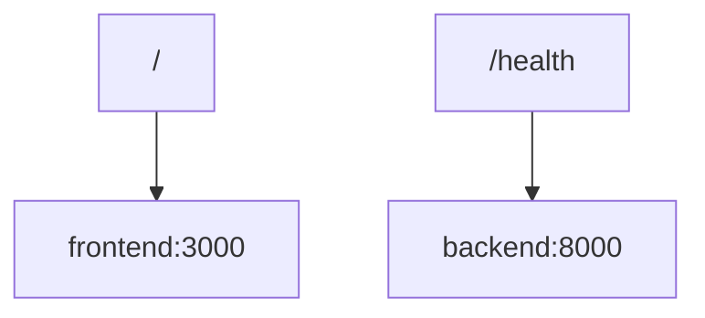

# Architecture

## Current System

The current architecture is a local Docker Compose environment with six services:

- Caddy reverse proxy
- Next.js frontend
- FastAPI backend
- PostgreSQL 16
- Redis 7
- Qdrant



## Service Responsibilities

| Service | Responsibility |
| --- | --- |
| `caddy` | Reverse proxy for frontend and backend routes. |
| `frontend` | Next.js user interface. |
| `backend` | FastAPI application and REST API. |
| `postgres` | Relational data store. No schema exists yet. |
| `redis` | Cache and future queue/session support. |
| `qdrant` | Vector database for future AI retrieval workflows. |

## Routing



Current externally exposed local ports:

- `80` for Caddy
- `8000` for direct backend health checks

## Backend Runtime

The backend uses `python:3.12-slim`.

Dependencies are installed directly into the runtime image from `backend/requirements.txt`. The backend starts with:

```bash
uvicorn app.main:app --host 0.0.0.0 --port 8000
```

## Architecture Change Policy

Any change to services, routes, runtime strategy, deployment topology, or cross-service communication must update this document.

