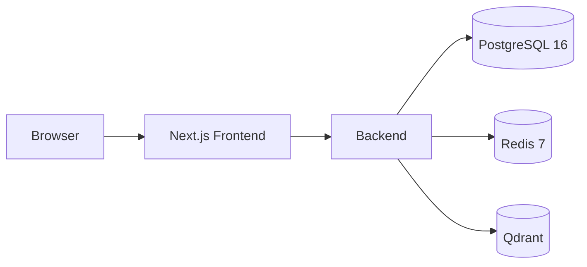
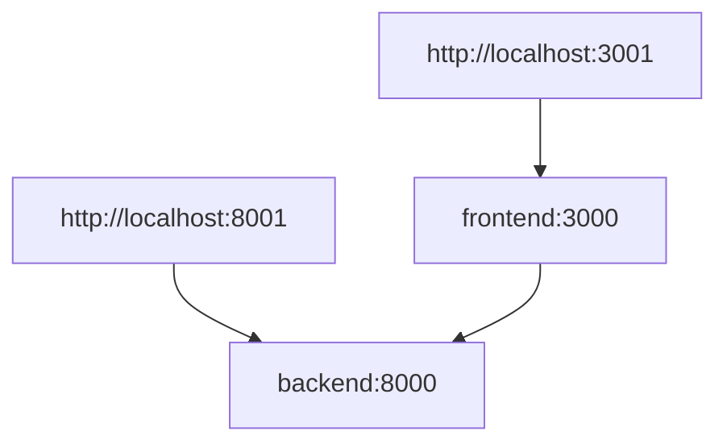

# Architecture

## Current System

The current development architecture is a local Docker Compose environment with five active services:

- Next.js frontend
- FastAPI backend
- PostgreSQL 16
- Redis 7
- Qdrant



## Service Responsibilities

| Service | Responsibility |
| --- | --- |
| `frontend` | Next.js user interface. |
| `backend` | FastAPI application and REST API. |
| `postgres` | Relational data store. No schema exists yet. |
| `redis` | Cache and future queue/session support. |
| `qdrant` | Vector database for future AI retrieval workflows. |

`Caddy` remains part of the repository for future production routing, but it is not started in local development mode.

## Routing



Current externally exposed local ports:

- `3001` for the frontend
- `8001` for the backend API and Swagger docs

## Development Mode

Local development does not use Caddy. This avoids host port conflicts on `3000` and removes the dependency on the reverse proxy being healthy before the UI becomes available.

The planned production topology still uses Caddy in front of the frontend and backend services.

## Backend Runtime

The backend uses `python:3.12-slim`.

Dependencies are installed directly into the runtime image from `backend/requirements.txt`. The backend starts with:

```bash
uvicorn app.main:app --host 0.0.0.0 --port 8000
```

## Architecture Change Policy

Any change to services, routes, runtime strategy, deployment topology, or cross-service communication must update this document.
