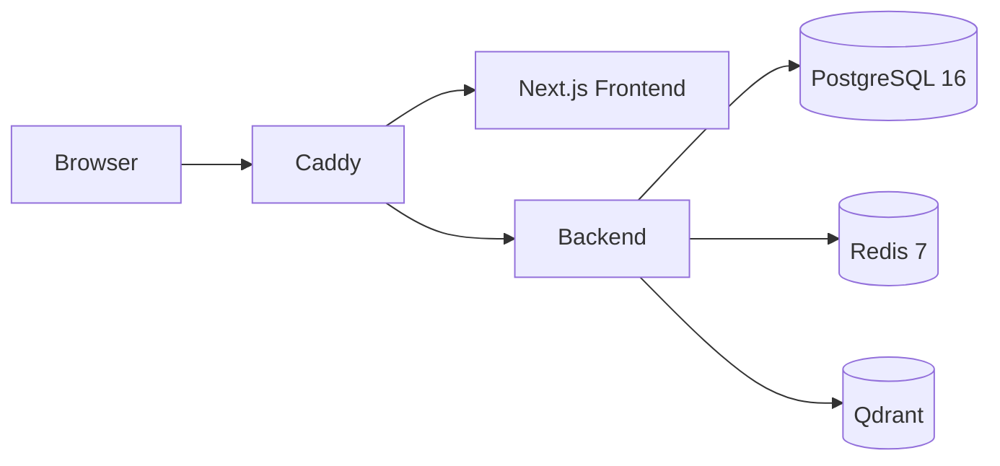
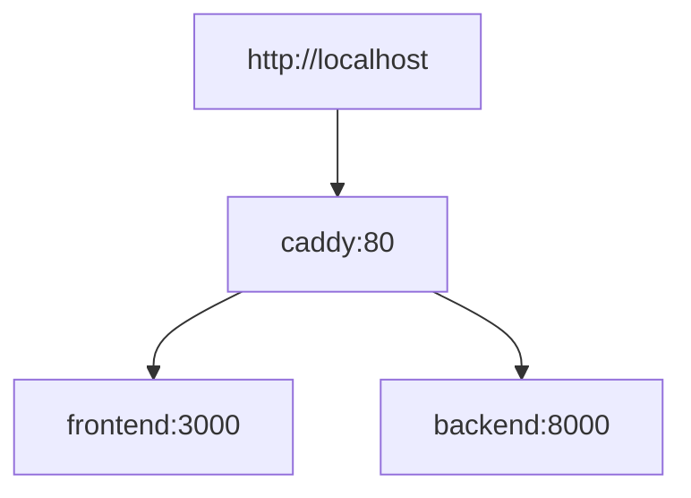
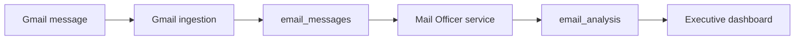

# Architecture

## Current System

The development and production architecture are the same. Both environments use Caddy as the single entry point in front of the frontend and backend services.

The current Docker Compose environment runs six active services:

- Caddy
- Next.js frontend
- FastAPI backend
- PostgreSQL 16
- Redis 7
- Qdrant



## Service Responsibilities

| Service | Responsibility |
| --- | --- |
| `caddy` | Reverse proxy and single public entry point for browser traffic. |
| `frontend` | Next.js user interface. |
| `backend` | FastAPI application, Gmail ingestion workflow, and dashboard REST API. |
| `postgres` | Relational data store for Gmail accounts, watch state, and stored email records. |
| `redis` | Cache and future queue/session support. |
| `qdrant` | Vector database for future AI retrieval workflows. |

## Routing



Primary public route:

- `http://localhost` -> Caddy -> frontend and backend

Routes served by Caddy:

- `/api/*` -> `backend:8000` with the `/api` prefix removed before proxying
- `/health` -> `backend:8000`
- `/gmail/*` -> `backend:8000`
- `/` -> `frontend:3000`

Optional debug ports:

- `3001` exposes the frontend container directly
- `8001` exposes the backend container directly

## Development Mode

Local development must keep the same reverse proxy topology as production. Bugs in Caddy, frontend, or backend integration must be fixed without bypassing Caddy as the primary path.

## Backend Runtime

The backend uses `python:3.12-slim`.

Dependencies are installed directly into the runtime image from `backend/requirements.txt`. The backend starts with:

```bash
uvicorn app.main:app --host 0.0.0.0 --port 8000
```

## Mail Officer Layer

Sprint 4 adds a business-intelligence layer inside the backend called Mail Officer.

Mail Officer sits on top of stored `email_messages` records and converts one stored Gmail message into one executive work item stored in `email_analysis`.



Mail Officer responsibilities:

- Read one stored email record.
- Load the executive-officer prompt from `backend/prompts/mail_officer.md`.
- Call the OpenAI API with a strict JSON schema.
- Store one structured analysis record per email.
- Surface summary, urgency, action requirement, reply requirement, deadline, and one recommended next step on the dashboard.

This does not change Gmail OAuth, Gmail Watch, Pub/Sub, or email-ingestion infrastructure. It is a pure business layer added on top of the existing stored-email pipeline.

## Architecture Change Policy

Any change to services, routes, runtime strategy, deployment topology, or cross-service communication must update this document.
