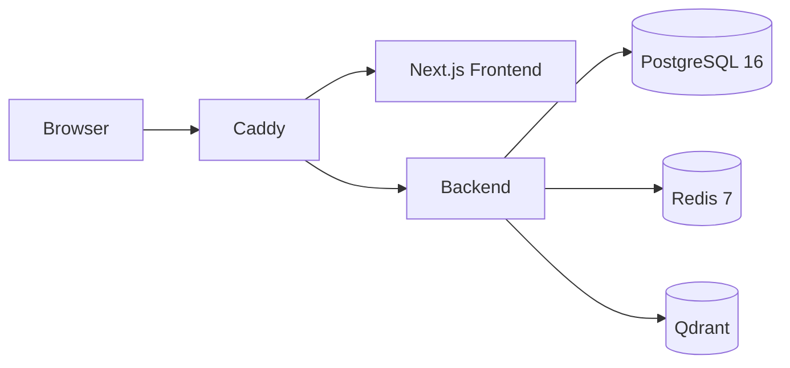
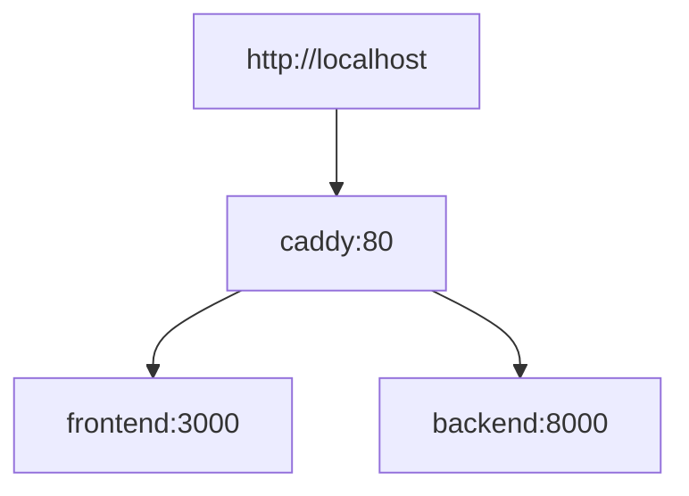

# Architecture

## Current System

The development and production architecture are the same. Both environments use Caddy as the single entry point in front of the frontend and backend services.

The current Docker Compose environment runs six active services:

- Caddy
- Next.js frontend
- FastAPI backend
- PostgreSQL 16
- Redis 7
- Qdrant



## Service Responsibilities

| Service | Responsibility |
| --- | --- |
| `caddy` | Reverse proxy and single public entry point for browser traffic. |
| `frontend` | Next.js user interface. |
| `backend` | FastAPI application and REST API. |
| `postgres` | Relational data store. No schema exists yet. |
| `redis` | Cache and future queue/session support. |
| `qdrant` | Vector database for future AI retrieval workflows. |

## Routing



Primary public route:

- `http://localhost` -> Caddy -> frontend and backend

Routes served by Caddy:

- `/api/*` -> `backend:8000` with the `/api` prefix removed before proxying
- `/health` -> `backend:8000`
- `/gmail/*` -> `backend:8000`
- `/` -> `frontend:3000`

Optional debug ports:

- `3001` exposes the frontend container directly
- `8001` exposes the backend container directly

## Development Mode

Local development must keep the same reverse proxy topology as production. Bugs in Caddy, frontend, or backend integration must be fixed without bypassing Caddy as the primary path.

## Backend Runtime

The backend uses `python:3.12-slim`.

Dependencies are installed directly into the runtime image from `backend/requirements.txt`. The backend starts with:

```bash
uvicorn app.main:app --host 0.0.0.0 --port 8000
```

## Architecture Change Policy

Any change to services, routes, runtime strategy, deployment topology, or cross-service communication must update this document.
