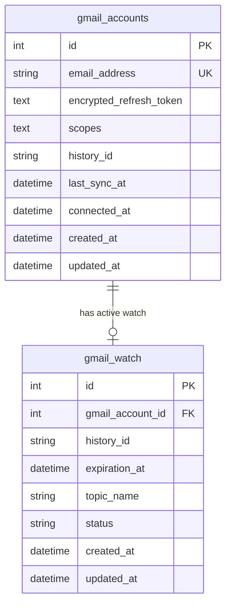

# Database

## Current State

The backend creates the Gmail integration tables on startup with SQLAlchemy metadata.

The local development environment includes PostgreSQL 16 with the default database:

| Setting | Value |
| --- | --- |
| Database | `immigration_ai_office` |
| User | `immigration` |
| Host inside Compose | `postgres` |
| Port inside Compose | `5432` |

## Current Relationships

| Table | Purpose |
| --- | --- |
| `gmail_accounts` | Stores connected Gmail accounts and encrypted refresh tokens. |
| `gmail_watch` | Stores Gmail Watch API subscription state for each connected account. |

## Schema Change Policy

Any schema, migration, table, index, enum, or relationship change must update this document in the same task.
