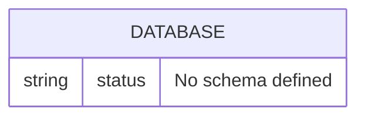

# Database

## Current State

No application database schema exists yet.

The local development environment includes PostgreSQL 16 with the default database:

| Setting | Value |
| --- | --- |
| Database | `immigration_ai_office` |
| User | `immigration` |
| Host inside Compose | `postgres` |
| Port inside Compose | `5432` |

## Current Relationships

No tables, relationships, migrations, or application models exist yet.

## Schema Change Policy

Any schema, migration, table, index, enum, or relationship change must update this document in the same task.

